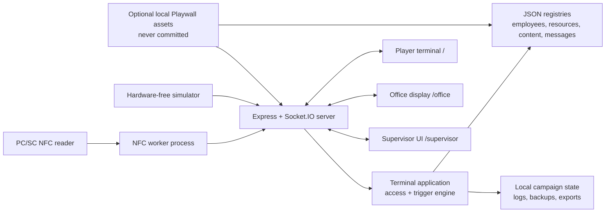

# Architecture

The application is a single Node.js process with static browser clients, Socket.IO updates, JSON registries, and an isolated NFC worker. It has no external database or cloud dependency.

## Components

| Area                                         | Responsibility                                                                                  |
| -------------------------------------------- | ----------------------------------------------------------------------------------------------- |
| `src/server.js`                              | Process composition, HTTP routes, Socket.IO events, NFC lifecycle, and browser launch.          |
| `src/nfc`                                    | PC/SC reader isolation, UID normalization, badge-present/removal events, and simulator support. |
| `src/application`                            | Coordinates a scan, access decision, state mutation, content unlocks, and effects.              |
| `src/access`, `src/triggers`                 | Evaluates resource access and declarative campaign rules; appends audit events.                 |
| `src/*Registry.js`                           | Loads and validates JSON definitions at startup.                                                |
| `src/public`, `src/office`, `src/supervisor` | The three browser interfaces.                                                                   |
| `data/*.json`                                | Versioned definitions plus ignored mutable campaign state.                                      |
| `data/assets`                                | App-owned media and optional, ignored Playwall derivatives.                                     |

## Request and state flow

1. The NFC worker reports a normalized badge UID, or the simulator posts one.
2. The server looks up the employee and selected resource.
3. `TerminalApplication` evaluates access and triggers against effective state.
4. State is persisted locally before the result is treated as complete.
5. Socket.IO broadcasts the appropriate result/effects to the browser clients.
6. The GM can inspect or mutate campaign state through the supervisor UI.

## Trust boundary

This is a theatrical prop, not an authentication system. NFC UIDs can be cloned. The supervisor routes and state-changing endpoints have no login, CSRF protection, rate limiting, or multi-user authorization. The localhost bind is therefore part of the security design. Any remote-access layer must provide authentication and TLS before traffic reaches the app.
